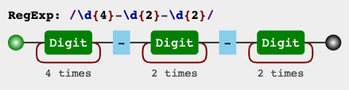
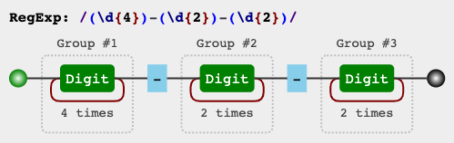
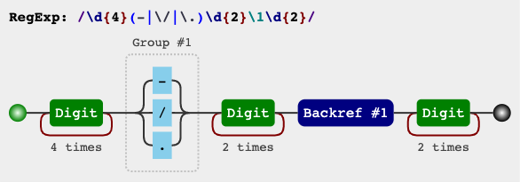
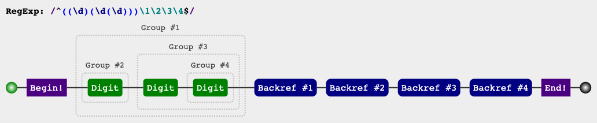

## 括号的作用

括号提供了分组，便于正则里引用。

### 分组和分支结构

这二者是括号最直觉的作用，也是最原始的功能，强调括号内的正则是一个整体，即提供子表达式。

#### 分组

`/a+/`可以匹配连续出现的 a，而要匹配连续出现的 ab 时，需要使用`/(ab)+/`。

其中括号提供的是分组功能，使用量词`+`，作用于 ab 这个整体。

```javascript
'ababa abbb ababab'.match(/(ab)+/g); // ['abab', 'ab', 'ababab']
```

#### 分支结构

而在多选分支结构`(p1|p2)`中，括号的作用也是不言而喻的，提供了分支表达式的所有可能。

比如，要匹配如下的字符串：

```javascript
// I love JavaScript
// I love Regular Expression

/^I love (JavaScript|Regular Expression)$/.test('I love JavaScript') // true
/^I love (JavaScript|Regular Expression)$/.test('I love Regular Expression') // true

```

### 分组引用

这是括号一个重要的作用，有了它，就可以进行数据提取，以及更强大的替换操作。

以日期为例，假设格式为 yyyy-mm-dd：

```javascript
const regex = /\d{4}-\d{2}-\d{2}/;
```

其可视化形式是：



修改为括号版：

```javascript
const regex = /(\d{4})-(\d{2})-(\d{2})/;
```

其可视化形式是：



与前者相比，后者多了分组编号，如 Group #1。 正则引擎在匹配过程中，会给每个分组都开辟一个空间，用来存储匹配到的

数据。

#### 提取数据

使用正则提取年月日：

```javascript
'2022-07-15'.match(/(\d{4})-(\d{2})-(\d{2})/); // ['2022-07-15', '2022', '07', '15', index: 0, input: '2022-07-15']
```

**match**返回一个数组，第一个元素是整体匹配结果，然后是各个分组（括号里）匹配的内容，然后是匹配下标，最后是输入文本。另外，正则是否有修饰符`g`，**match**返回的数组格式是不一样的。

另外也可以使用正则实例对象的**exec**方法：

```javascript
/(\d{4})-(\d{2})-(\d{2})/.exec('2022-07-15'); // ['2022-07-15', '2022', '07', '15', index: 0, input: '2022-07-15']
```

同时也可以使用构造函数的全局属性 $1 至 $9 来获取：

```javascript
/(\d{4})-(\d{2})-(\d{2})/.test('2022-07-15');
RegExp.$1; // 2017
RegExp.$2; // 07
RegExp.$3; // 15
```

#### 替换

例如，把 yyyy-mm-dd 格式替换成 mm/dd/yyyy：

```javascript
'2022-07-15'.replace(/(\d{4})-(\d{2})-(\d{2})/, '$2/$3/$1'); // '07/15/2022'
```

**replace**中的，第二个参数里用$1、$2、$3 指代相应的分组。

等价于如下的形式：

```javascript
'2022-07-15'.replace(/(\d{4})-(\d{2})-(\d{2})/, () => `${RegExp.$2}/${RegExp.$3}/${RegExp.$1}`);
```

也等价于：

```javascript
'2022-07-15'.replace(
  /(\d{4})-(\d{2})-(\d{2})/,
  (match, year, mouth, day) => `${mouth}/${day}/${year}`
);
```

### 反向引用

除了使用相应 API 来引用分组，也可以在正则本身里引用分组。但只能引用之前出现的分组，即反向引用。

以日期为例，要写一个正则匹配如下三种格式：

```tex
2022-07-15
2022/07/15
2022.07.15
```

最先可能想到的正则是：

```javascript
/\d{4}(-|\/|\.)\d{2}(-|\/|\.)\d{2}/;
```

虽然这个正则匹配了要求的情况，但也匹配了 2022-07/15 这样的数据。

如果想要要求分割符前后一致，此时需要使用反向引用：

```javascript
/\d{4}(-|\/|\.)\d{2}\1\d{2}/;
```

正则里的`\1`，表示引用之前的那个分组`(-|\/|\.)`，不管它匹配到什么，`\1`都匹配相同的字符。

其可视化形式是：



理解`\1`后，`\2`和`\3`，即分别指代第二和第三个分组。

#### **关于括号嵌套**

以左括号（开括号）为准。比如：

```javascript
/^((\d)(\d(\d)))\1\2\3\4$/.test('1231231233'); // true
RegExp.$1; // 123
RegExp.$2; // 1
RegExp.$3; // 23
RegExp.$4; // 3
```

`\1`是第一个分组内容，找到第 1 个开括号对应的分组，是 123。

`\2`找到第 2 个开括号对应的分组，是 1。

`\3`找到第 3 个开括号对应的分组，是 23。

`\4`找到第 4 个开括号对应的分组，是 3。

其可视化形式是：



#### 关于\10

`\10`是表示第 10 个分组，还是`\1`和 0 呢？

```javascript
/(1)(2)(3)(4)(5)(6)(7)(8)(9)(#) \10+/.test('123456789 ###'); // true
```

答案是表示第 10 个分组。

如果要匹配`\1`和 0，请使用`(?:\1)0`或者`\1(?:0)`。

#### 引用不存在的分组

引用不存在的分组，正则不会报错，而是匹配字符的转义。

例如`\2`，就匹配 '\2' 。注意 '\2' 表示对 '2' 进行了转义

```javascript
/\1\2\3\4\5\6\7\8\9/.test('\1\2\3\4\5\6\789'); // true
```

#### 分组后面有量词

分组后面有量词，则最终捕获到的数据是最后一次的匹配：

```javascript
'12345'.match(/(\d)+/); // ['12345', '5', index: 0, input: '12345']
```

同理对于反向引用，也是这样的：

```javascript
/(\d)+ \1/.test('12345 1') // false
/(\d)+ \1/.test('12345 5') // true
```

#### 非捕获括号

如果想用括号最原始的功能（分组和分支），但不会引用它，即既不在 API 里引用，也不是正则里反引用。可以使用非捕获括号`(?:p)`和`(?:p1|p2|p3)`。

```javascript
'ababa abbb ababab'.match(/(?:ab)+/g); // ['abab', 'ab', 'ababab']
```
