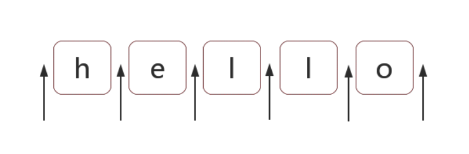

### **位置匹配**

正则表达式是匹配模式，要么匹配字符，要么匹配位置。

#### 什么是位置

位置（锚）是相邻字符之间的位置。比如，下图中箭头所指的地方：



#### 匹配位置

##### ^ 和 $

`^`（脱字符）匹配开头。多行匹配中匹配行开头。

`$`（美元符）匹配结尾。多行匹配中匹配行结尾。

比如，把字符串的开头和结尾用 # 替换（位置可以替换成字符）：

```javascript
'hello'.replace(/^|$/g, '#'); // '#hello#'
```

多行匹配模式（即有修饰符 m）时，二者是行的概念：

```javascript
'I\nlove\njavascript'.replace(/^|$/gm, '#'); // '#I#\n#love#\n#javascript#'
```

##### \b 和 \B

`\b`是单词边界。具体就是`\w`与`\W`之间的位置，也包括`\w`与`^`之间的位置，和`\w`与`$`之间的位置。

比如考察文件名`[JS] Lesson_01.mp4`中的`\b`，如下：

```javascript
'[JS] Lesson_01.mp4'.replace(/\b/g, '#'); // '[#JS#] #Lesson_01#.#mp4#'
```

`\B`就是`\b`的反面的意思，非单词边界。具体就是`\w`与`\w`、`\W`与`\W`、`^`与`\W`，`\W`与 `$`之间的位置。

比如，把所有`\B`替换成 #：

```javascript
'[JS] Lesson_01.mp4'.replace(/\B/g, '#'); // '#[J#S]# L#e#s#s#o#n#_#0#1.m#p#4'
```

##### (?=p) 和 (?!p)

`(?=p)`，其中 p 是一个子模式，即右边是 p 位置。或者说，该位置后面的字符要匹配 p。

比如`(?=l)`，表示右边是字符 l 的位置，例如：

```javascript
'hello'.replace(/(?=l)/g, '#'); // 'he#l#lo'
```

`(?!p)`，即右边的字符不能匹配 p。

比如`(?!l)`，表示右边不是字符 l 的位置，例如：

```javascript
'hello'.replace(/(?!l)/g, '#'); // '#h#ell#o#'
```

二者的学名分别是 positive lookahead（正向先行断言）和 negative lookahead（负向先行断言）。

##### (?<=p) 和 (?<!p)

`(?<=p)`，其中 p 是一个子模式，即左边是 p 的位置。或者说，该位置前面的字符要匹配 p。

比如`(?<=l)`，表示左边是字符 l 的位置，例如：

```javascript
'hello'.replace(/(?<=l)/g, '#'); // 'hel#l#o'
```

`(?<!p)`，即左边的字符不能匹配 p。

比如`(?<!l)`，表示左边不是字符 l 的位置，例如：

```javascript
'hello'.replace(/(?<!l)/g, '#'); // '#h#e#llo#'
```

二者的学名分别是 positive lookbehind（正向后行断言） 和 negative lookbehind（负向后行断言）。

#### 位置的特性

对于位置，可以理解成空字符串 ""。

比如 'hello' ，字符串等价于如下的形式：

```javascript
'hello' == '' + 'h' + '' + 'e' + '' + 'l' + '' + 'l' + '' + 'o' + '';
```

也等价于：

```javascript
'hello' == '' + '' + 'hello';
```

因此，把`/^hello$/`写成`/^^hello$$$/`，是没有任何问题的：

```javascript
/^^hello$$$/.test('hello'); // true
```

甚至可以写成更复杂的：

```javascript
/(?=he)^^he(?=\w)llo$\b\b$/.test('hello'); // true
```

也就是说字符之间的位置，可以写成多个。 把位置理解成空字符，是对位置非常有效的理解。
